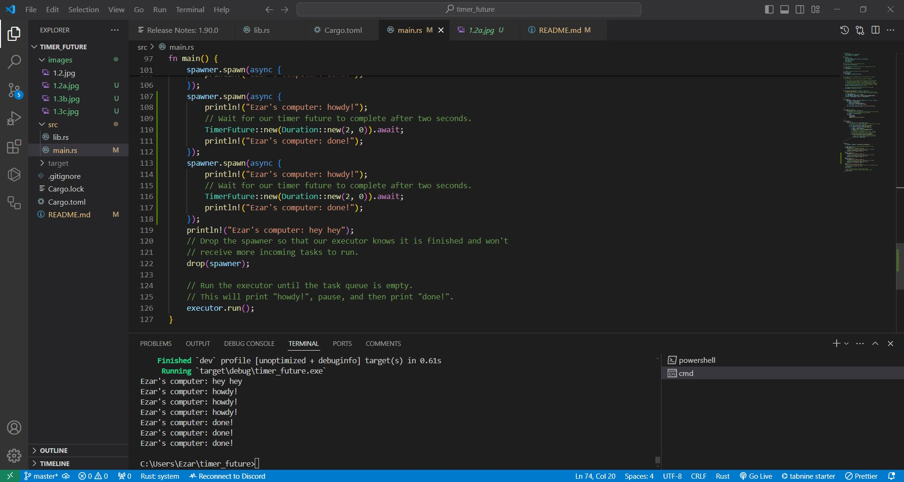
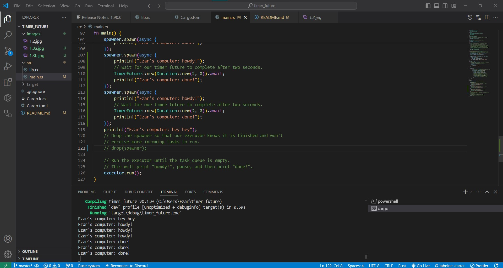

Mochammad Ezar Yudha 2206046746
<h1>Tutorial 10</h1>
<h3>1.2. Understanding how it works</h3>

"Ezar's computer: hey hey" is printed first because it's a synchronous operation and executed immediately in the main function. "Ezar's computer: howdy!" comes next as part of an asynchronous task. It's printed while the main function continues. Finally, "Ezar's computer: done!" is printed last. This happens after the asynchronous task finishes waiting for two seconds and then resumes to print the message.

<h3>Experiment 1.3: Multiple Spawn and removing drop</h3>

Removing drop(spawner) caused the spawner to continue to exist. Consequently, the executor did not know that it was finished.